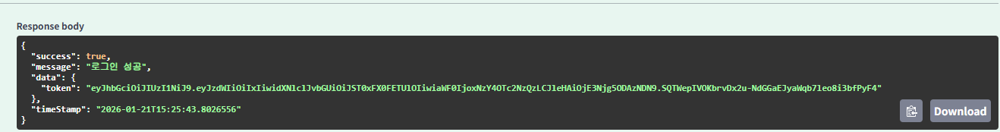
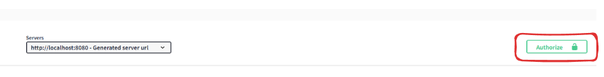
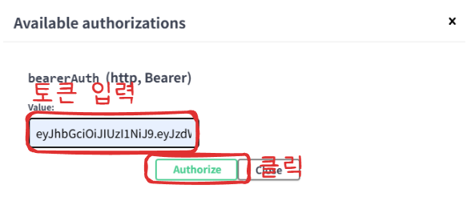

## Swagger UI 

### 개요

로컬 환경에서 API 문서는 Swagger UI를 통해 확인할 수 있습니다.

- Swagger UI: http://localhost:8080/swagger-ui/index.html

### JWT 인증 방법

본 프로젝트는 JWT 기반 인증을 사용합니다.

1. `/auth/login` API를 호출하여 access token을 발급받습니다.

2. Swagger UI 우측 상단의 **Authorize** 버튼을 클릭합니다.

3. 아래 형식으로 토큰을 입력합니다.

4. Authorize 버튼을 클릭한 후 보호된 API를 호출할 수 있습니다.

### Request Body 입력 방법

Swagger UI에서 Request Body가 필요한 API는 다음 순서로 테스트할 수 있습니다.

1. API 선택 후 **Try it out** 버튼 클릭
2. Request Body 영역에 JSON 형식으로 값 입력
3. **Execute** 버튼 클릭